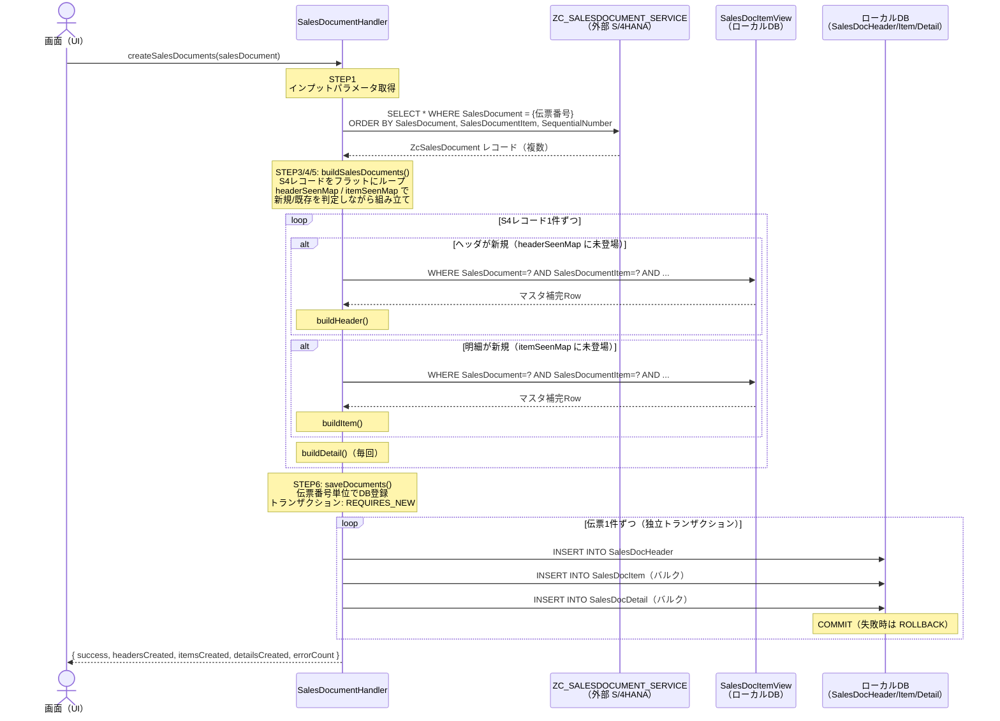

# SalesDocumentHandler 設計ドキュメント

## 概要

`createSalesDocuments` アクションのイベントハンドラ。
画面から伝票番号を受け取り、S/4HANA の CDS View（ZcSalesDocument）とマスタデータを使用して
売上伝票の3種類のエンティティ（ヘッダ・明細・詳細）を作成し、DBに登録する。

> **NOTE:** マスタデータ取得方法が変わる場合は `fetchMasterData()` のみ修正する。呼び出し元への影響はない。

---

## 処理フロー図



---

## 各STEPの詳細

### STEP1 - インプットパラメータ取得

画面から `EventContext` 経由で伝票番号を受け取る。

```java
String salesDocument = (String) ctx.get("salesDocument");
```

```
EventContext
  └─ salesDocument : "4500000001"   ← 必須
  └─ forceUpdate   : false          ← 省略可（現在は未使用）
```

---

### STEP2 - ZcSalesDocument 取得

外部サービス `ZC_SALESDOCUMENT_SERVICE` に伝票番号を検索条件として投げる。
ソート順を固定することで後続の Map 処理における処理順序を安定させる。

```java
var query = Select.from(S4_ENTITY)
    .where(q -> q.get("SalesDocument").eq(salesDocument))
    .orderBy(
        q -> q.get("SalesDocument").asc(),
        q -> q.get("SalesDocumentItem").asc(),
        q -> q.get("SequentialNumber").asc()
    );
```

```
取得結果イメージ（1伝票 = 複数レコード）:

SalesDocument | SalesDocumentItem | SequentialNumber | DetailCategory | MaterialCode | CustomerID | ...
4500000001    | 000010            | 001              | PR             | MATNR001     | C0000001   |
4500000001    | 000010            | 002              | SL             | MATNR001     | C0000001   |
4500000001    | 000020            | 001              | PR             | MATNR002     | C0000001   |
```

> ZcSalesDocument の1レコードは「明細 × 詳細（連番）」の組み合わせ単位。
> ヘッダ情報（CustomerID 等）は各レコードに重複して含まれる。

---

### STEP3/4/5 - `buildSalesDocuments()` - エンティティ組み立て

#### 新規/既存判定の仕組み

ZcSalesDocument のキー構成は `SalesDocument + SalesDocumentItem + SequentialNumber`。
同一レコードが複数行ある場合（SequentialNumber が異なる）は、新しい詳細の行を意味する。
Map を使うことで、ヘッダ・明細が「初出かどうか」を O(1) で判定できる。

```
キーと判定ルール:

headerSeenMap: key = SalesDocument
  → containsKey = false  ⇒ 新規ヘッダ（マスタ取得 + buildHeader）
  → containsKey = true   ⇒ 既存ヘッダ（スキップ）

itemSeenMap: key = SalesDocument + "_" + SalesDocumentItem
  → containsKey = false  ⇒ 新規明細（マスタ取得 + buildItem）
  → containsKey = true   ⇒ 既存明細（スキップ）

詳細: 常に buildDetail（SequentialNumber 単位で必ず新規）
```

#### S4レコードのトレース例

```
レコード1: 4500000001 / 000010 / 001
  headerSeenMap: {} → containsKey=false → 新規ヘッダ作成 put("4500000001")
  itemSeenMap:   {} → containsKey=false → 新規明細作成 put("4500000001_000010")
  詳細001 を details に追加
  TotalNetAmount = 0 + 10,000 = 10,000

レコード2: 4500000001 / 000010 / 002   ← 同一明細の連番違い
  headerSeenMap: containsKey=true → ヘッダスキップ
  itemSeenMap:   containsKey=true → 明細スキップ（重複加算を防ぐ）
  詳細002 を details に追加（詳細は常に追加）

レコード3: 4500000001 / 000020 / 001   ← 別明細
  headerSeenMap: containsKey=true → ヘッダスキップ
  itemSeenMap:   "4500000001_000020" なし → 新規明細作成 put
  詳細001 を details に追加
  TotalNetAmount = 10,000 + 20,000 = 30,000
```

#### STEP4 - SalesDocItemView からマスタデータ取得（S4レコード単位）

ヘッダ・明細の新規判定時（初回登場時のみ）に `fetchMasterData()` を呼び出す。
S4レコードの6項目を検索条件として SalesDocItemView に問い合わせる。

```java
Result result = db.run(
    Select.from(MASTER_VIEW)
          .where(v -> v.get("SalesDocument")      .eq(salesDocument)
                 .and(v.get("SalesDocumentItem")   .eq(salesDocumentItem))
                 .and(v.get("SalesOrganization")   .eq(salesOrganization))
                 .and(v.get("DistributionChannel") .eq(distributionChannel))
                 .and(v.get("Division")            .eq(division))
                 .and(v.get("CustomerID")          .eq(customerId)))
);
```

#### SalesDocItemView の役割

```
OrderHeader（受注ヘッダ）
  └─ LEFT JOIN CustomerMaster（CustomerID + SalesOrg + DistChannel + Division）
  └─ LEFT JOIN MaterialMaster（MaterialCode）
  └─ LEFT JOIN PlantMaster（Plant）

→ 1回のクエリでマスタ3種類の補完値がまとめて取得できる
```

> **NOTE:** SalesDocItemView の起点テーブルや結合方法が変わる場合でも、
> `fetchMasterData()` メソッド内のみ修正すれば呼び出し元への影響はない。

#### 各エンティティのマッピング元

| エンティティ | フィールド | 取得元 |
| --- | --- | --- |
| SalesDocHeader | SalesDocument, SalesOrganization, DistributionChannel, Division | ZcSalesDocument |
| SalesDocHeader | SalesDocumentDate, SalesDocumentType, CustomerID, Currency | ZcSalesDocument |
| SalesDocHeader | TotalNetAmount | ZcSalesDocument の NetAmount を明細初回登場時に累計 |
| SalesDocHeader | CustomerName, CustomerGroup | SalesDocItemView（CustomerMaster補完） |
| SalesDocItem | SalesDocument, SalesDocumentItem, MaterialCode | ZcSalesDocument |
| SalesDocItem | OrderQuantity, OrderQuantityUnit, NetAmount, Currency | ZcSalesDocument |
| SalesDocItem | Plant, StorageLocation, PricingDate | ZcSalesDocument |
| SalesDocItem | MaterialName, MaterialGroup | SalesDocItemView（MaterialMaster補完） |
| SalesDocItem | PlantName, CompanyCode | SalesDocItemView（PlantMaster補完） |
| SalesDocDetail | 全フィールド | ZcSalesDocument のみ |

#### buildSalesDocuments() の返却形式

```
buildResults = {
  "4500000001" → SalesDocBuildResult {
    header      : SalesDocHeader { SalesDocument=4500000001, TotalNetAmount=30,000, headerIsNew=true }
    itemEntries : [
      SalesDocItemEntry { item=SalesDocItem{000010, MATNR001}, isNew=true }
      SalesDocItemEntry { item=SalesDocItem{000020, MATNR002}, isNew=true }
    ]
    details : [
      SalesDocDetail { 000010/001 }
      SalesDocDetail { 000010/002 }
      SalesDocDetail { 000020/001 }
    ]
  }
  "4500000002" → SalesDocBuildResult { ... }
}
```

---

### STEP6 - `saveDocuments()` - DB登録（伝票番号単位トランザクション）

#### トランザクション設計

```
【なぜ TransactionTemplate を使うか】
Spring の @Transactional はプロキシ経由で動作する。
同一クラス内の self-call ではプロキシを経由しないため @Transactional が効かない。
TransactionTemplate はプロキシ不要でプログラム的にトランザクションを制御できる。

【PROPAGATION_REQUIRES_NEW の動作】
CAP @On ハンドラ（外側トランザクション = CAP ChangeSet）
  ├─ 伝票A: execute() → 外側を suspend → 独立トランザクション開始 → COMMIT ✅
  ├─ 伝票B: execute() → 外側を suspend → 独立トランザクション開始 → COMMIT ✅
  └─ 伝票C: execute() → 外側を suspend → 独立トランザクション開始 → ROLLBACK ❌
                          ↑ RuntimeException 発生
→ 伝票A・Bのデータは残る。伝票Cのデータのみ取り消される。
→ 外側の CAP ChangeSet がロールバックしても、コミット済み伝票のデータは DB に残る。
```

#### 1伝票あたりの登録処理

```java
transactionTemplate.execute(status -> {

    // ① ヘッダ登録（1件）
    db.run(Insert.into(HEADER_ENTITY).entry(result.header));

    // ② 明細登録（バルクINSERT）
    db.run(Insert.into(ITEM_ENTITY).entries(items));

    // ③ 詳細登録（バルクINSERT）
    db.run(Insert.into(DETAIL_ENTITY).entries(result.details));

    return null;  // ① ② ③ すべて成功 → COMMIT
    // ① 成功後に ② でエラー → ① ② ③ すべて ROLLBACK
});
```

---

## DB アクセス回数

| 処理 | DB往復 | 説明 |
|---|---|---|
| ZcSalesDocument 取得（STEP2） | 1回 | 外部サービスへのクエリ |
| SalesDocItemView 取得（STEP4） | ヘッダ・明細のユニーク件数分 | 新規判定時のみ取得（既存はスキップ） |
| ヘッダ INSERT（STEP6） | 伝票件数分 | 1伝票 = 1回 |
| 明細 INSERT（STEP6） | 伝票件数分 | entries() でバルクINSERT |
| 詳細 INSERT（STEP6） | 伝票件数分 | entries() でバルクINSERT |

> 明細・詳細の件数が増えてもバルクINSERT により DB往復は伝票件数分のみ。

---

## クラス・メソッド構成

```text
SalesDocumentHandler
  │
  ├─ init()                    ← @PostConstruct: TransactionTemplate（REQUIRES_NEW）の初期化
  │
  ├─ onCreateSalesDocuments()  ← アクションのエントリポイント（全体オーケストレーション）
  │
  ├─ fetchZcSalesDocuments()   ← STEP2: 外部S4からソースデータ取得
  │
  ├─ fetchMasterData()         ← STEP4: SalesDocItemViewからマスタ取得（S4レコード単位）
  │                               ※将来の取得方法変更はここだけ修正
  │
  ├─ buildSalesDocuments()     ← STEP3/4/5: フラットループ・Map判定・エンティティ組み立て
  │
  ├─ saveDocuments()           ← STEP6: 伝票番号単位でDB登録（REQUIRES_NEW トランザクション）
  │
  ├─ buildHeader()             ← SalesDocHeader の組み立て
  ├─ buildItem()               ← SalesDocItem の組み立て
  ├─ buildDetail()             ← SalesDocDetail の組み立て
  │
  └─ setResult()               ← EventContext への返却値セット


  内部クラス:
  ├─ SalesDocItemEntry         ← 明細エンティティ + isNew フラグのペア
  └─ SalesDocBuildResult       ← 伝票単位の組み立て結果（header + itemEntries + details）
```

---

## 関連ファイル

| ファイル | 役割 |
|---|---|
| [srv/service.cds](../srv/service.cds) | サービス定義・SalesDocItemView の定義 |
| [db/schema.cds](../db/schema.cds) | エンティティ定義（SalesDocHeader/Item/Detail, OrderHeader） |
| [srv/external/ZC_SALESDOCUMENT_SERVICE.cds](../srv/external/ZC_SALESDOCUMENT_SERVICE.cds) | 外部S4サービス定義 |
| [srv/src/main/java/.../SalesDocumentHandler.java](../srv/src/main/java/customer/verification/SalesDocumentHandler.java) | このドキュメントが説明するハンドラ本体 |
