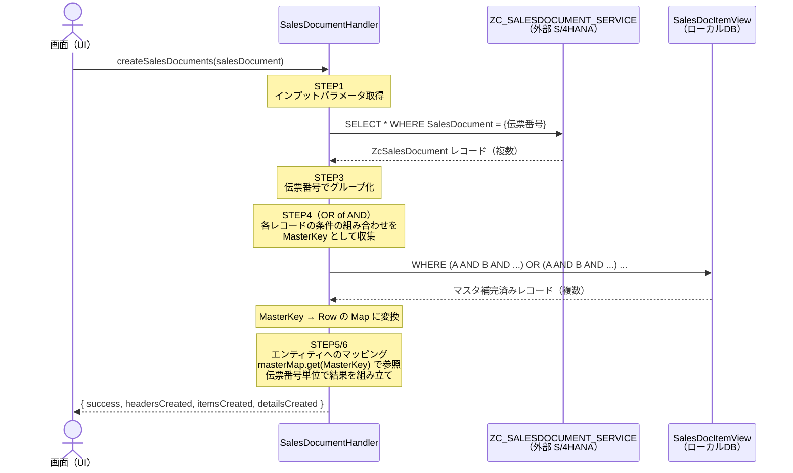

# SalesDocumentHandler 設計ドキュメント

## 概要

`createSalesDocuments` アクションのイベントハンドラ。
画面から伝票番号を受け取り、S/4HANA の CDS View（ZcSalesDocument）とマスタデータを使用して
売上伝票の3種類のエンティティ（ヘッダ・明細・詳細）を作成する。

> **NOTE:** このハンドラはデータの「作成」のみを担う。DB への登録は別機能が行う。

---

## 処理フロー図



---

## 各STEPの詳細

### STEP1 - インプットパラメータ取得

画面から `EventContext` 経由で伝票番号を受け取る。

```java
String salesDocument = (String) ctx.get("salesDocument");
```

```
EventContext
  └─ salesDocument : "4500000001"   ← 必須
  └─ forceUpdate   : false          ← 省略可（現在は未使用）
```

---

### STEP2 - ZcSalesDocument 取得

外部サービス `ZC_SALESDOCUMENT_SERVICE` に伝票番号を検索条件として投げる。

```java
var query = Select.from(S4_ENTITY)
    .where(q -> q.get("SalesDocument").eq(salesDocument))
    .orderBy(
        q -> q.get("SalesDocument").asc(),
        q -> q.get("SalesDocumentItem").asc(),
        q -> q.get("SequentialNumber").asc()
    );
```

```
取得結果イメージ（1伝票 = 複数レコード）:

SalesDocument | SalesDocumentItem | SequentialNumber | DetailCategory | MaterialCode | CustomerID | ...
4500000001    | 000010            | 001              | PR             | MATNR001     | C0000001   |
4500000001    | 000010            | 002              | SL             | MATNR001     | C0000001   |
4500000001    | 000020            | 001              | PR             | MATNR002     | C0000001   |
```

> ZcSalesDocument の1レコードは「明細 × 詳細（連番）」の組み合わせ単位。
> ヘッダ情報（CustomerID 等）は各レコードに重複して含まれる。

---

### STEP3 - 伝票番号でグループ化

```java
Map<String, List<Row>> byDocument = s4Records.stream()
    .collect(Collectors.groupingBy(
        r -> (String) r.get("SalesDocument"),
        LinkedHashMap::new,   // 取得順序を保持
        Collectors.toList()
    ));
```

```
byDocument = {
  "4500000001" → [Row(000010/001), Row(000010/002), Row(000020/001)]
  "4500000002" → [Row(000010/001), ...]
}
```

---

### STEP4 - SalesDocItemView からマスタデータ一括取得（OR of AND）

#### なぜ OR of AND なのか

検索条件が複数フィールドの「組み合わせ」単位であるため、単純な IN 句では正確な絞り込みができない。

```
❌ 単純 IN 句
  WHERE SalesDocument IN ('4500000001', '4500000002')
  → 伝票番号しか絞れない。条件の組み合わせが一致しない余剰レコードが混入する可能性がある。

✅ OR of AND（このコードの方式）
  WHERE (SalesDocument='4500000001' AND SalesDocumentItem='000010' AND CustomerID='C001' AND ...)
     OR (SalesDocument='4500000001' AND SalesDocumentItem='000020' AND CustomerID='C001' AND ...)
     OR (SalesDocument='4500000002' AND SalesDocumentItem='000010' AND CustomerID='C002' AND ...)
  → 条件の組み合わせ単位で正確に絞り込める。
```

#### MasterKey - 条件の組み合わせを表すキー

```java
record MasterKey(
    String salesDocument,      // SalesDocItemView のキー
    String salesDocumentItem,  // SalesDocItemView のキー
    String salesOrganization,  // CustomerMaster の JOIN キー
    String distributionChannel,// CustomerMaster の JOIN キー
    String division,           // CustomerMaster の JOIN キー
    String customerId          // CustomerMaster の JOIN キー
) {}
```

Java の `record` は `equals` / `hashCode` が自動生成されるため、Map のキーとして正しく機能する。

#### 取得〜Map変換の4ステップ

```java
// ① ZcSalesDocument の各レコードから条件の組み合わせ（重複なし）を収集
Set<MasterKey> uniqueKeys = s4Records.stream()
    .map(r -> new MasterKey(
        (String) r.get("SalesDocument"),
        (String) r.get("SalesDocumentItem"),
        (String) r.get("SalesOrganization"),
        (String) r.get("DistributionChannel"),
        (String) r.get("Division"),
        (String) r.get("CustomerID")
    ))
    .collect(Collectors.toSet());

// ② 組み合わせごとに AND 条件を生成
List<CqnPredicate> orConditions = uniqueKeys.stream()
    .map(k -> CQL.get("SalesDocument")     .eq(k.salesDocument())
        .and(CQL.get("SalesDocumentItem")  .eq(k.salesDocumentItem()))
        .and(CQL.get("SalesOrganization")  .eq(k.salesOrganization()))
        .and(CQL.get("DistributionChannel").eq(k.distributionChannel()))
        .and(CQL.get("Division")           .eq(k.division()))
        .and(CQL.get("CustomerID")         .eq(k.customerId())))
    .collect(Collectors.toList());

// ③ 全 AND 条件を OR でつないで 1 回のクエリで取得
CqnPredicate combined = orConditions.stream()
    .reduce(CqnPredicate::or)
    .orElseThrow();

Result result = db.run(Select.from(MASTER_VIEW).where(combined));

// ④ MasterKey → Row の Map に変換（後のマッピングで O(1) 参照するため）
Map<MasterKey, Row> masterMap = new HashMap<>();
result.forEach(row -> {
    MasterKey key = new MasterKey( /* row から同じフィールドを取り出す */ );
    masterMap.putIfAbsent(key, row);
});
```

#### 取得結果のイメージ

```
① uniqueKeys（Set）
  MasterKey("4500000001", "000010", "1000", "10", "00", "C0000001")
  MasterKey("4500000001", "000020", "1000", "10", "00", "C0000001")
  MasterKey("4500000002", "000010", "2000", "10", "00", "C0000002")

② → ③ 発行される SQL
  WHERE (SalesDocument='4500000001' AND SalesDocumentItem='000010' AND SalesOrganization='1000' AND ...)
     OR (SalesDocument='4500000001' AND SalesDocumentItem='000020' AND SalesOrganization='1000' AND ...)
     OR (SalesDocument='4500000002' AND SalesDocumentItem='000010' AND SalesOrganization='2000' AND ...)

④ masterMap（HashMap）
  MasterKey("4500000001","000010",...) → { CustomerName=テック商事,   MaterialName=製品A, PlantName=東京工場, ... }
  MasterKey("4500000001","000020",...) → { CustomerName=テック商事,   MaterialName=製品B, PlantName=大阪工場, ... }
  MasterKey("4500000002","000010",...) → { CustomerName=グローバル物産, MaterialName=製品C, PlantName=東京工場, ... }
```

#### SalesDocItemView の役割

```
OrderHeader（受注ヘッダ）
  └─ LEFT JOIN CustomerMaster（CustomerID + SalesOrg + DistChannel + Division）
  └─ LEFT JOIN MaterialMaster（MaterialCode）
  └─ LEFT JOIN PlantMaster（Plant）

→ 1回のクエリでマスタ3種類の補完値がまとめて取得できる
```

> **NOTE:** SalesDocItemView の起点テーブルや結合方法が変わる場合でも、
> `fetchMasterData()` メソッド内のみ修正すれば呼び出し元への影響はない。

---

### STEP5/6 - エンティティへのマッピング・返却

#### toMasterKey() - キー生成の一元化

`fetchMasterData`（Map構築時）と `buildSalesDocuments`（Map参照時）で同じキー生成ロジックを使う必要があるため、`toMasterKey()` に切り出している。

```java
private MasterKey toMasterKey(String salesDocument, Row row) {
    return new MasterKey(
        salesDocument,
        (String) row.get("SalesDocumentItem"),
        (String) row.get("SalesOrganization"),
        (String) row.get("DistributionChannel"),
        (String) row.get("Division"),
        (String) row.get("CustomerID")
    );
}
// キーの構成フィールドが変わる場合はここだけ修正する
```

#### グループ化と処理の構造

```
byDocument（伝票番号でグループ）
  └─ 伝票 4500000001
      ├─ toMasterKey(docNum, first)  → MasterKey
      ├─ masterMap.get(MasterKey)    → headerMaster（CustomerMaster補完値）
      ├─ buildHeader()               → SalesDocHeader（1件）
      │
      └─ byItem（明細番号でグループ）
          ├─ 明細 000010
          │    ├─ toMasterKey(docNum, firstItem) → MasterKey
          │    ├─ masterMap.get(MasterKey)        → itemMaster（Material/Plant補完値）
          │    ├─ buildItem()                     → SalesDocItem（1件）
          │    ├─ buildDetail()                   → SalesDocDetail（SequentialNumber 001）
          │    └─ buildDetail()                   → SalesDocDetail（SequentialNumber 002）
          │
          └─ 明細 000020
               ├─ toMasterKey(docNum, firstItem) → MasterKey（別の組み合わせ）
               ├─ masterMap.get(MasterKey)        → itemMaster（別のMaterial/Plant補完値）
               ├─ buildItem()                     → SalesDocItem（1件）
               └─ buildDetail()                   → SalesDocDetail（SequentialNumber 001）
```

#### 各エンティティのマッピング元

| エンティティ | フィールド | 取得元 |
|---|---|---|
| SalesDocHeader | SalesDocument, SalesOrganization, DistributionChannel, Division | ZcSalesDocument |
| SalesDocHeader | SalesDocumentDate, SalesDocumentType, CustomerID, Currency | ZcSalesDocument |
| SalesDocHeader | TotalNetAmount | ZcSalesDocument の NetAmount を伝票単位で合計 |
| SalesDocHeader | CustomerName, CustomerGroup | SalesDocItemView（CustomerMaster補完） |
| SalesDocItem | SalesDocument, SalesDocumentItem, MaterialCode | ZcSalesDocument |
| SalesDocItem | OrderQuantity, OrderQuantityUnit, NetAmount, Currency | ZcSalesDocument |
| SalesDocItem | Plant, StorageLocation, PricingDate | ZcSalesDocument |
| SalesDocItem | MaterialName, MaterialGroup | SalesDocItemView（MaterialMaster補完） |
| SalesDocItem | PlantName, CompanyCode | SalesDocItemView（PlantMaster補完） |
| SalesDocDetail | 全フィールド | ZcSalesDocument のみ |

#### 返却形式

```java
Map<String, SalesDocBuildResult> results = {
  "4500000001" → SalesDocBuildResult {
                   header  : SalesDocHeader（1件）
                   items   : List<SalesDocItem>（明細件数分）
                   details : List<SalesDocDetail>（連番件数分）
                 }
  "4500000002" → SalesDocBuildResult { ... }
}
// DB登録は行わない。登録は別機能が担う。
```

---

## DB アクセス回数

| 処理 | DB往復 | 説明 |
|---|---|---|
| ZcSalesDocument 取得（STEP2） | 1回 | 外部サービスへのクエリ |
| SalesDocItemView 取得（STEP4） | 1回 | OR of AND で全条件をまとめて取得 |
| エンティティ組み立て（STEP5/6） | 0回 | masterMap.get(MasterKey) でメモリ内参照 O(1) |
| **合計** | **2回** | **件数・明細数に依存しない** |

---

## クラス・メソッド構成

```
SalesDocumentHandler
  │
  ├─ onCreateSalesDocuments()    ← アクションのエントリポイント（全体オーケストレーション）
  │
  ├─ fetchZcSalesDocuments()     ← STEP2: 外部S4からソースデータ取得
  │
  ├─ fetchMasterData()           ← STEP4: SalesDocItemViewからマスタ一括取得（OR of AND）
  │                                 ※将来の取得方法変更はここだけ修正
  │
  ├─ buildSalesDocuments()       ← STEP5/6: グループ化・マッピング・返却
  │
  ├─ buildHeader()               ← SalesDocHeader の組み立て
  ├─ buildItem()                 ← SalesDocItem の組み立て
  ├─ buildDetail()               ← SalesDocDetail の組み立て
  │
  └─ toMasterKey()               ← MasterKey 生成の一元化（fetchMasterData / buildSalesDocuments 共用）


  内部クラス / record:
  ├─ MasterKey                   ← 条件の組み合わせを表すキー（record: equals/hashCode 自動生成）
  └─ SalesDocBuildResult         ← 伝票単位の作成結果保持（header + items + details）
```

---

## 関連ファイル

| ファイル | 役割 |
|---|---|
| [srv/service.cds](../srv/service.cds) | サービス定義・SalesDocItemView の定義 |
| [db/schema.cds](../db/schema.cds) | エンティティ定義（SalesDocHeader/Item/Detail, OrderHeader） |
| [srv/external/ZC_SALESDOCUMENT_SERVICE.cds](../srv/external/ZC_SALESDOCUMENT_SERVICE.cds) | 外部S4サービス定義 |
| [srv/src/main/java/.../SalesDocumentHandler.java](../srv/src/main/java/customer/verification/SalesDocumentHandler.java) | このドキュメントが説明するハンドラ本体 |
